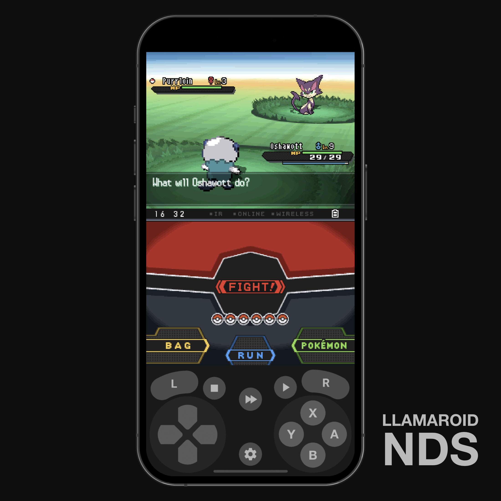

# 💻 NDS Skins

## Llamaroid

#### Created by [C7XL](https://discordapp.com/users/330683206854639627)

* Devices: Edge to Edge
* Orientations: Portrait
* Extra Buttons: Fast Forward

### [Download](../../Community%20Skins/Llamaroid\_NDS.deltaskin)

<figure><figcaption></figcaption></figure>

## NTR

#### Created by [epicpal](https://discordapp.com/users/281835162474512385)

This skin tries to maximize screen size as much as possible. The buttons reflect what’s on screen and change in color.

* Devices: Edge to Edge
* Orientations: Portrait

### [Download](../../Community%20Skins/ntr.deltaskin)

## Fullscreen Landscape Skin \[FSLS]

#### Created by [Tomkef](https://discordapp.com/users/208228152839897088)

* Devices: Edge to Edge
* Orientations: Landscape
* Extra Buttons: Fast Forward, Quick Save

### [Download](../../Community%20Skins/FSLS\_v2.2.deltaskin)

<figure><figcaption></figcaption></figure>

## Touch DS

#### Created by [e10.](https://discordapp.com/users/279456607174131713)

This is a skin intended for touchscreen-only DS games- such as Ace Attorney, Hotel Dusk, or Dr. Kawashima’s Brain Training

* Devices: Standard, Edge to Edge
* Orientations: Portrait
* Extra Buttons: Fast Forward, Quick Save, Quick Load

### [Download](../../Community%20Skins/TouchDS.deltaskin)

