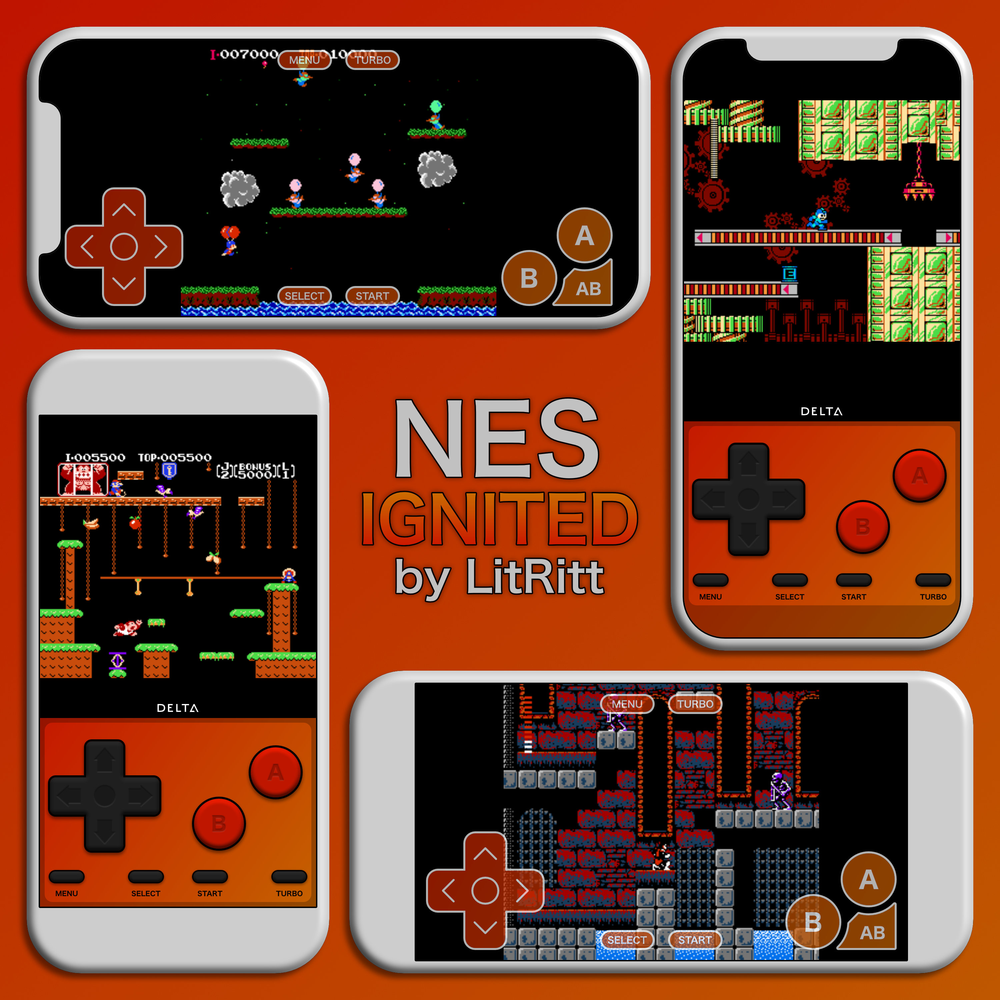

# 🔥 Ignited

* Devices: Standard, Edge to Edge
* Orientations: Portrait, Landscape
* Extra Buttons: Fast Forward

## Lit Theme



### [Download](Ignited/Orange/NDS/skin.deltaskin)

.png>)



### [Download](Ignited/Orange/GBA/skin.deltaskin)

.png>)



### [Download](Ignited/Orange/GBC/skin.deltaskin)

.png>)



### [Download](Ignited/Orange/SNES/skin.deltaskin)

.png>)



### [Download](Ignited/Orange/NES/skin.deltaskin)




## Purple Theme



### [Download](Ignited/Purple/NDS/skin.deltaskin)

.png>)



### [Download](Ignited/Purple/GBA/skin.deltaskin)

.png>)



### [Download](Ignited/Purple/GBC/skin.deltaskin)

.png>)



### [Download](Ignited/Purple/SNES/skin.deltaskin)

.png>)



### [Download](Ignited/Purple/NES/skin.deltaskin)

.png>)


