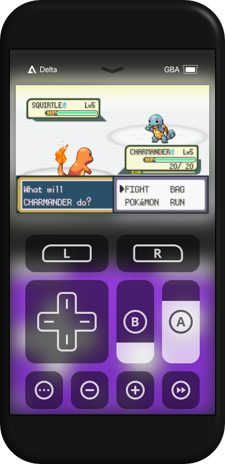
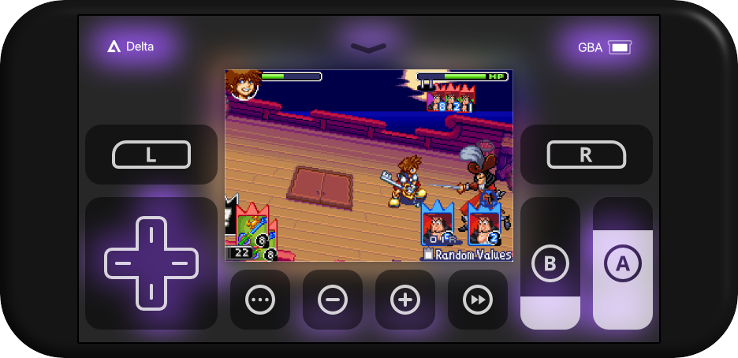
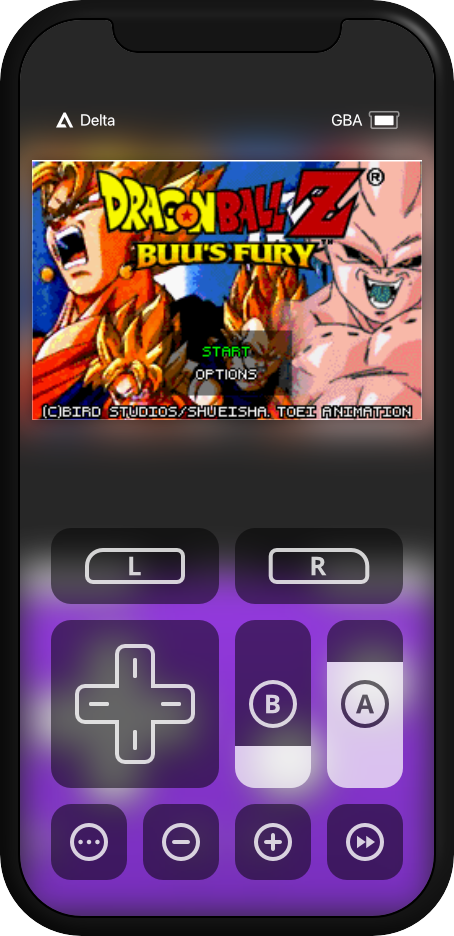
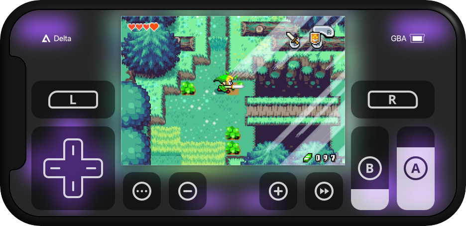
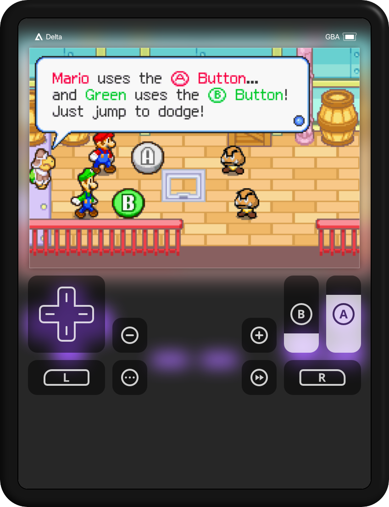
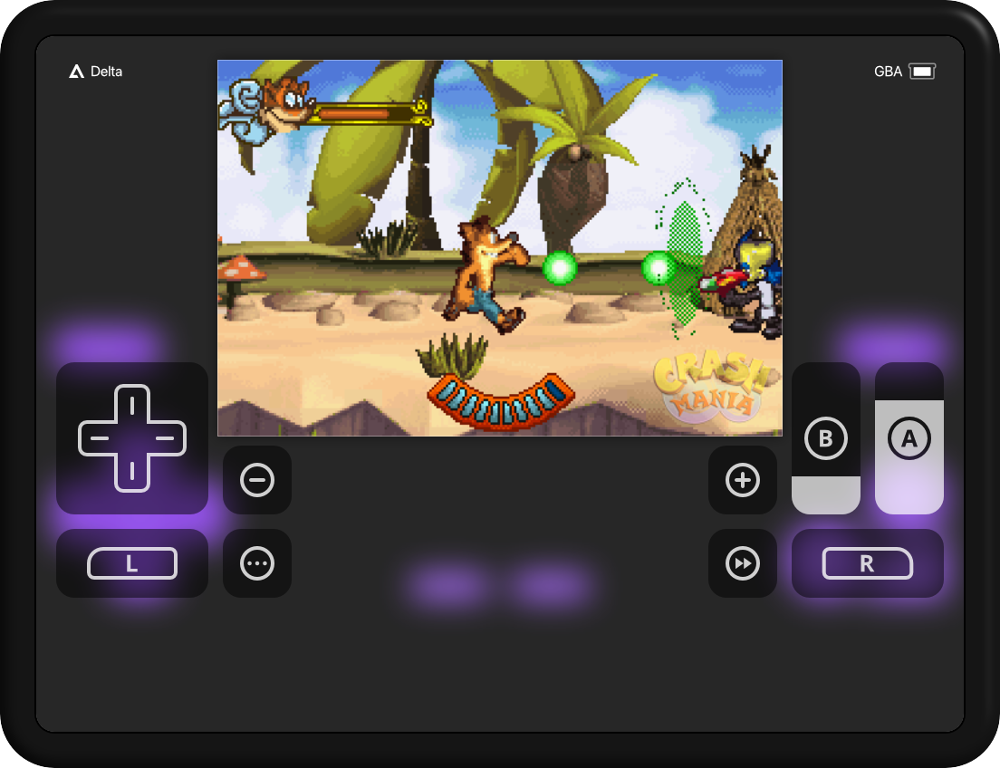
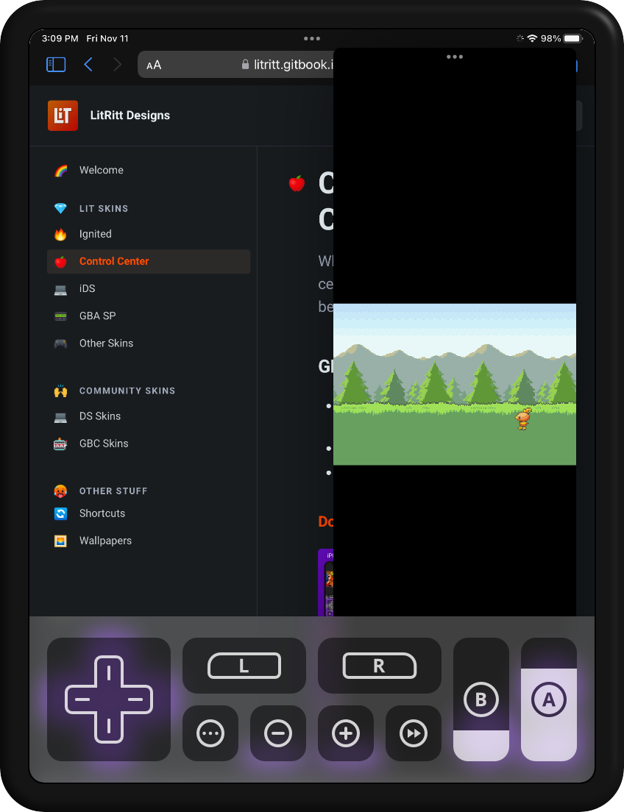
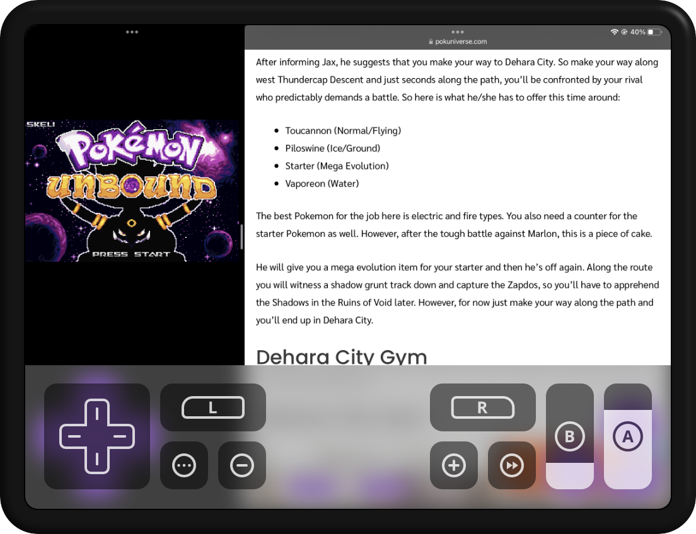

# 🍎 Lit CC

## GBA

* Devices: Standard, Edge to Edge, iPad
* Orientations: Portrait, Landscape, Split View
* Extra Buttons: Fast Forward

### [Download](Lit-CC/GBA/skin.deltaskin)

### iPhone

<figure><figcaption>
Standard Portrait
</figcaption></figure>

 

<figure><figcaption>
Standard Landscape
</figcaption></figure>

 

<figure><figcaption>
Edge to Edge Portrait
</figcaption></figure>

 

<figure><figcaption>
Edge to Edge Landscape
</figcaption></figure>

### iPad

<figure><figcaption>
Standard Portrait
</figcaption></figure>

 

<figure><figcaption>
Standard Landscape
</figcaption></figure>

 

<figure><figcaption>
Split View Portrait
</figcaption></figure>

 

<figure><figcaption>
Split View Landscape
</figcaption></figure>

## GBC

* Devices: Standard, Edge to Edge
* Orientations: Portrait, Landscape
* Extra Buttons: Fast Forward

### [Download](Lit-CC/GBC/skin.deltaskin)

<figure><figcaption></figcaption></figure>

## NES

* Devices: Standard, Edge to Edge
* Orientations: Portrait, Landscape
* Extra Buttons: Fast Forward

### [Download](Lit-CC/NES/skin.deltaskin)

<figure><figcaption></figcaption></figure>
